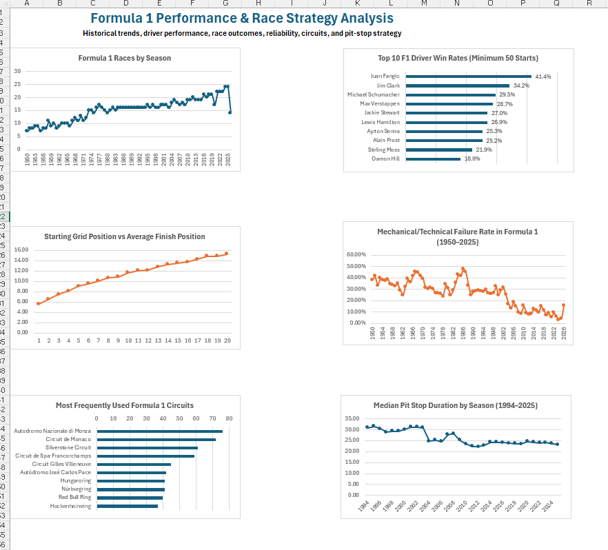

# Formula 1 Performance & Race Strategy Analysis

An Excel-based data analysis project exploring historical Formula 1 trends, driver performance, race outcomes, reliability, circuits, and pit-stop strategy.

The project uses **Power Query, Excel Data Model, DAX, PivotTables, and data visualization** to transform and analyze multi-table Formula 1 data spanning 1950–2026.

## Dashboard Preview

## Project Objective

The goal of this project is to explore Formula 1 performance and race strategy through historical race data and answer questions such as:

- How has Formula 1 changed in terms of races, drivers, and constructors over time?
- Which established drivers have achieved the highest race win rates?
- How strongly is starting grid position associated with finishing position?
- How have mechanical and technical race outcomes changed across F1 history?
- Which circuits have hosted the most Formula 1 races?
- How has median pit-stop duration changed over time?

## Dataset & Scope

The analysis uses a multi-table Formula 1 dataset containing historical information on races, drivers, constructors, circuits, race results, qualifying, lap times, pit stops, standings, sprint results, and race statuses.

- **Race coverage:** 1950–2026
- **Races:** 1,172 scheduled race records
- **Race result records:** 27,546
- **Drivers:** 865
- **Constructors:** 214
- **Circuits:** 78
- **Lap-time records:** 882,027
- **Pit-stop records:** 22,668

The 2026 season is still in progress, so analyses involving race counts or season-level trends treat 2026 as **year-to-date (YTD)** where applicable. Historical comparisons also account for differences in data availability across tables; for example, lap-time, qualifying, and pit-stop data do not cover the full history of Formula 1.
